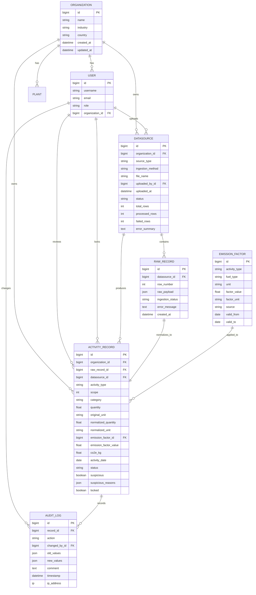
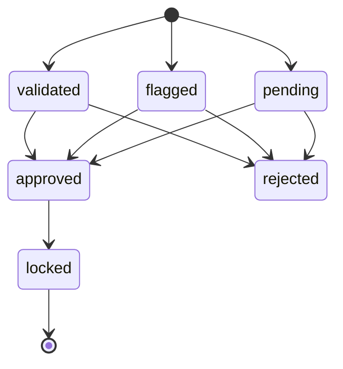

# MODEL.md - Data Model and Rationale

This project models ESG carbon accounting as an auditable pipeline:

```text
Organization -> DataSource -> RawRecord -> ActivityRecord -> AuditLog
```

The model is designed to answer five evaluation-critical questions:

1. Which tenant owns this data?
2. Which source file and source row produced this emissions row?
3. What Scope 1/2/3 category does the row belong to?
4. What unit conversion and emission factor produced the CO2e value?
5. Who changed, approved, rejected, or locked the row, and when?

## Entity Relationship Diagram



## Multi-Tenancy

`Organization` is the tenant root. Users belong to one organization, and all business data is scoped through that organization.

Tenant-scoped tables:

- `User.organization`
- `Plant.organization`
- `DataSource.organization`
- `ActivityRecord.organization`

Derived tenant scope:

- `RawRecord` belongs to a `DataSource`, so its tenant is the data source's organization.
- `AuditLog` belongs to an `ActivityRecord`, so its tenant is the activity record's organization.

The API enforces tenant isolation by filtering querysets through `request.user.organization`. For example:

- Upload history only returns `DataSource` rows for the user's organization.
- Review queue only returns `ActivityRecord` rows for the user's organization.
- Audit logs only return logs where `record.organization == request.user.organization`.

Why this model: a single tenant root keeps the implementation clear and prevents accidental cross-company visibility. It also allows future organization-level configuration, such as region-specific emission factors or approval rules.

## Scope 1/2/3 Categorization

The core normalized row is `ActivityRecord`. It stores:

- `scope`: integer choice of `1`, `2`, or `3`
- `category`: normalized category such as `stationary_combustion`, `purchased_electricity`, or `business_travel`
- `activity_type`: user-readable type such as `Diesel Combustion`, `Purchased Electricity`, or `Business Flight`

Scope assignment is done in the source normalizers:

| Source | Scope | Why |
| --- | --- | --- |
| SAP fuel/procurement | Scope 1 | Fuel combustion owned or controlled by the company. |
| Utility electricity | Scope 2 | Purchased electricity consumption. |
| Travel expenses | Scope 3 | Business travel is indirect value-chain activity. |

Why this model: storing scope and category directly on the activity row makes filtering, dashboards, and audit exports simple. It also preserves the classification used at the time of review.

## Source-of-Truth Tracking

The model separates raw input from normalized output.

### `DataSource`

Represents the uploaded file or source batch.

Important fields:

- `source_type`: `sap`, `utility`, or `travel`
- `ingestion_method`: currently `csv`
- `file_name`
- `uploaded_by`
- `uploaded_at`
- `status`
- row counts and error summary

This answers: which source produced the batch, who uploaded it, and when?

### `RawRecord`

Stores the exact CSV row as JSON in `raw_payload`.

Important fields:

- `datasource`
- `row_number`
- `raw_payload`
- `ingestion_status`
- `error_message`

Raw payloads are treated as immutable source-of-truth data. The application updates ingestion status and error metadata, but not the original `raw_payload`.

### `ActivityRecord`

Stores the normalized, reviewable emissions row. It links back to both:

- `raw_record`: exact source row
- `datasource`: upload batch/source file

This double link is intentional. `raw_record` gives exact row traceability, while `datasource` makes filtering by upload efficient.

## Unit Normalization

Each `ActivityRecord` stores both original and normalized values:

| Field | Meaning |
| --- | --- |
| `quantity` | Quantity exactly interpreted from source row. |
| `original_unit` | Unit as reported or inferred from the source. |
| `normalized_quantity` | Quantity converted to the standard unit used for calculation. |
| `normalized_unit` | Standard unit such as `liters`, `kg`, `kWh`, `passenger-km`, `room-night`, or `km`. |

Why store both: analysts need to see what came in and what the system used for calculation. This also helps debug incorrect unit assumptions.

Examples:

- SAP `GAL` is converted to `liters`.
- SAP `TON` is converted to `kg`.
- Utility `MWh` is converted to `kWh`.
- Travel flights are converted to `passenger-km` when airport coordinates are available.

## Emission Factor Model

`EmissionFactor` stores configurable factor records:

- `activity_type`
- `fuel_type`
- `unit`
- `factor_value`
- `factor_unit`
- `source`
- `valid_from`
- `valid_to`

`ActivityRecord` stores both:

- `emission_factor`: FK to the factor record
- `emission_factor_value`: numeric snapshot used during calculation

Why both: the FK keeps the row explainable, while the snapshot protects historical calculations if the factor record is later updated.

Current calculation:

```text
co2e_kg = normalized_quantity * emission_factor_value
```

## Validation and Suspicious Records

Validation flags are stored on the activity row:

- `suspicious`: boolean summary
- `suspicious_reasons`: JSON list of rule results

Current rules include:

- non-finite quantity
- negative quantity
- zero quantity
- missing or unknown unit
- future date
- suspicious spike against category average
- extreme value threshold

Records with flags are created as `flagged`; clean records are created as `validated`.

## Review Lifecycle

Activity records support this status flow:



Review fields:

- `reviewed_by`
- `reviewed_at`
- `reviewer_comment`
- `locked`
- `locked_at`
- `locked_by`

Locked records cannot be edited through the normal update endpoint.

## Audit Trail

`AuditLog` records every meaningful change:

- `created`
- `updated`
- `approved`
- `rejected`
- `locked`
- `unlocked`
- `comment`

Each audit log stores:

- the activity record
- the action
- the user who changed it
- old values as JSON
- new values as JSON
- comment
- timestamp
- optional IP address

Why JSON old/new values: edits may touch different fields. A JSON diff keeps the schema flexible while preserving the before/after state.

## Why This Model

This model was chosen because it separates concerns cleanly:

- Raw data is preserved separately from normalized data.
- Tenant ownership is explicit.
- Review state is visible on the main activity row.
- Audit history is append-only and queryable.
- The system can support more sources later by adding normalizers without changing the core activity table.

The tradeoff is that this is not yet a full data warehouse model. It favors traceability and demo clarity over advanced dimensions like reporting periods, factor version catalogs, geographical grids, or facility hierarchies.
